# 
### 나에게 핏한 건강관리 에이전트 **LinkCare**

 

## 프로젝트 설명
국민건강보험의 건강검진 데이터를 기록하고, 사용자가 자신의 건강 상태와 생활 습관을 꾸준히 관리하며 AI의 조언을 받을 수 있는 헬스케어 모바일 웹 서비스

## 프로젝트 정보
- 개발 인원 : 4명
- 개발 기간 : 2026-07-15 ~ 2026-08-07
- Frontend : Next.js(App Router), Typescript
- Backend : NestJs, Typescript, Prisma
- DB : PostgreSQL

## 프로젝트 내용

### **HOME**
- AI 인사
- 데일리 건강 관리(혈압∙혈당∙체중)
- 식단 관리
- 데일리 쉴드 (감정∙활력∙물∙운동∙영양제)

|데일리 건강관리|데일리 쉴드|
|--|--|
|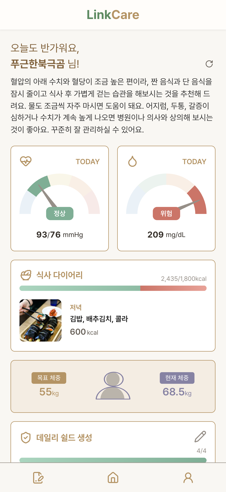|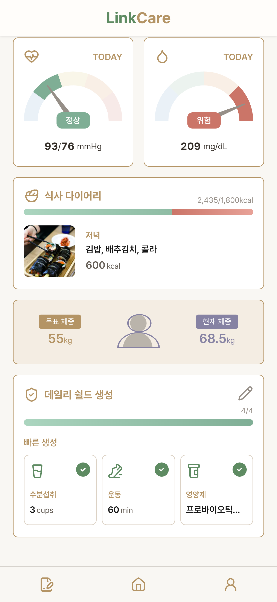|

### **Daily 건강 관리**
- 매일 측정한 혈압/혈당 기록
- 입력한 체중으로 BMI 계산 및 목표체중과의 차이 표시
- 시간대별 기록 여부에 따른 기록페이지 표출
- 상태 태그와 상태에 따라 변하는 바 차트
- 오늘 기준 7일간의 기록 변화 추이와 3개월간의 상태 달력

|혈압|혈당|체중|
|--|--|--|
|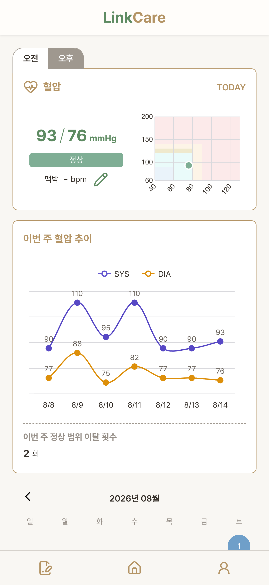|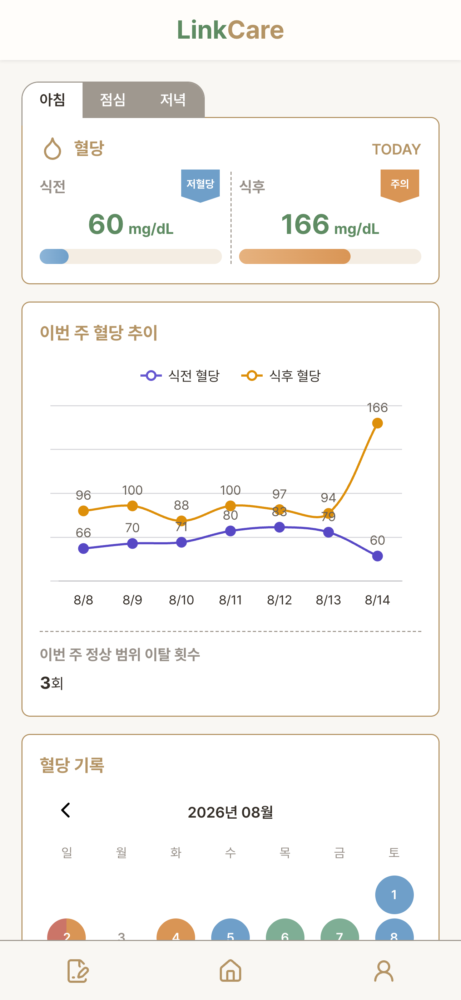|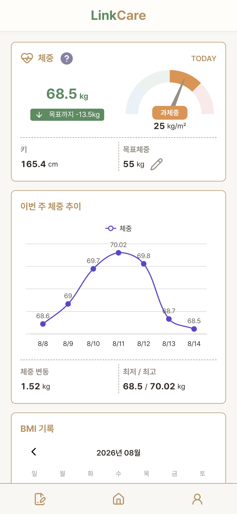|

### **식사 다이어리**
- 목표 칼로리를 설정하고 매일의 식단 관리
- 음식 사진 AI 분석으로 음식명/칼로리 표시
- 최대 3개월간의 기록 조회

|식사|식사 입력|목표 칼로리|
|--|--|--|
|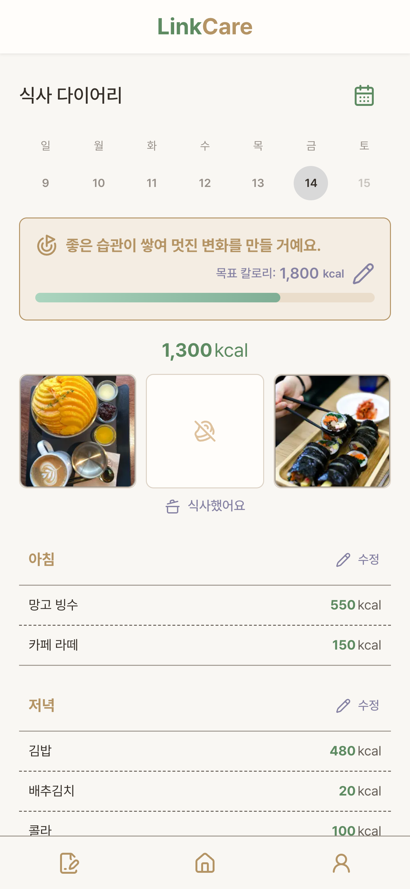|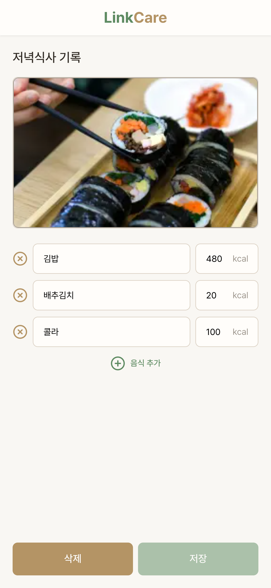|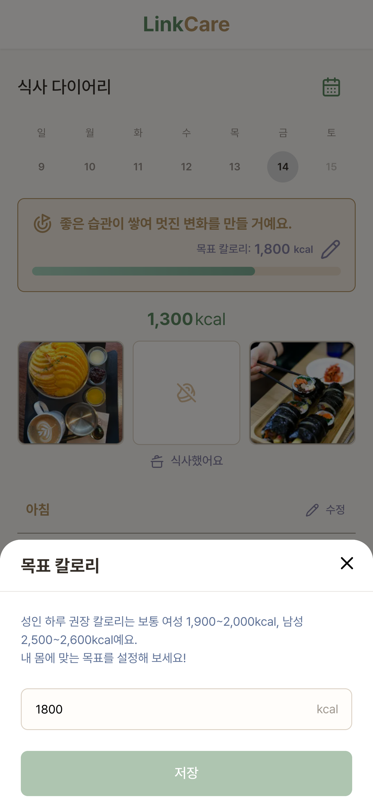|

### **건강검진**
- 건강검진 결과 업로드 & 조회
- AI를 활용하여 PDF 파일 파싱
- AI 총평, AI 조언, 분류에 따른 데이터, 상태 조회
- 분류별 상세 데이터, 상태, 추이 조회

|대시보드|신체지표|혈압|
|--|--|--|
|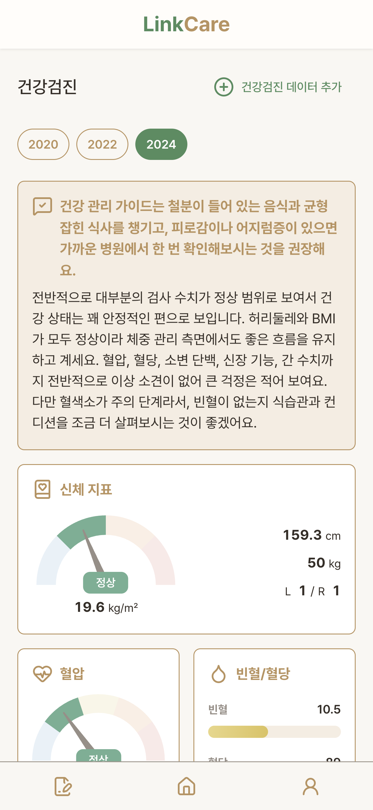|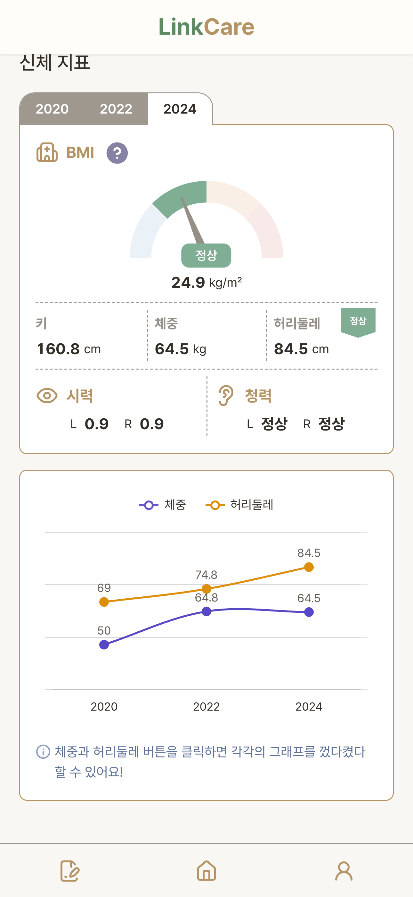|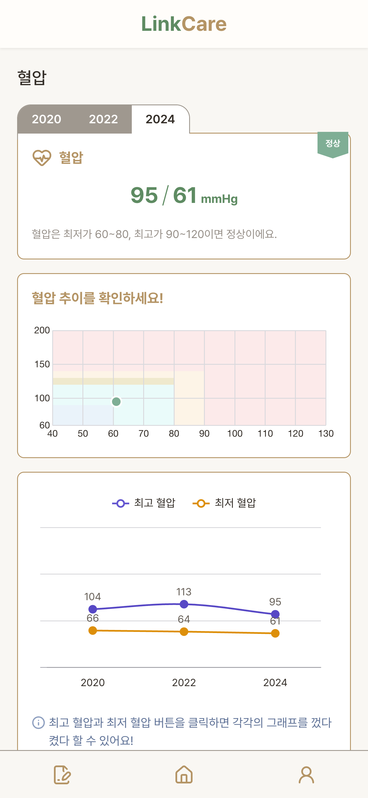|

### **마이페이지**
- 닉네임, 성별, 생년월일, 키 수정
- 비밀번호 변경
- 로그아웃, 회원탈퇴

|마이페이지|회원정보 수정|비밀번호 변경|회원 탈퇴|
|--|--|--|--|
|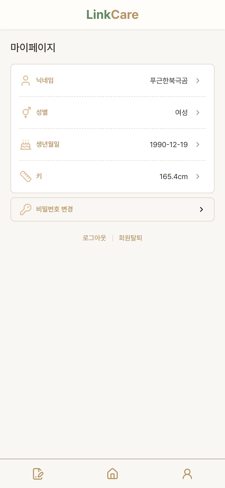|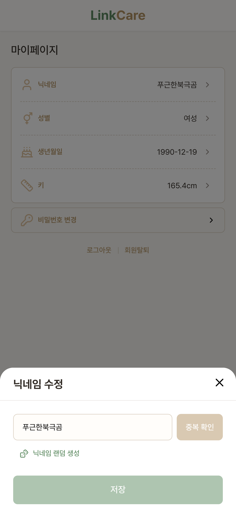|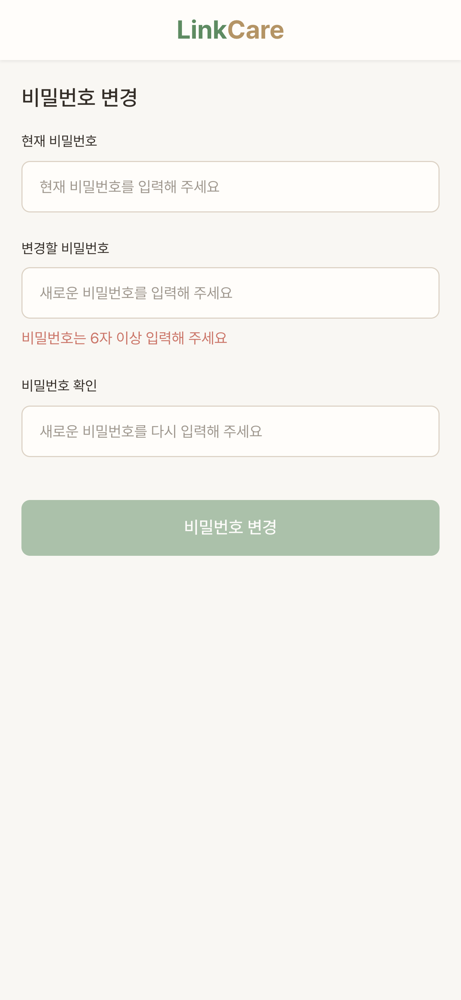|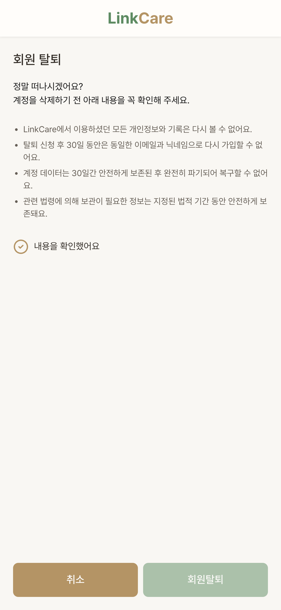|

## 기술 스택

  
  
  
  
  
  
  

